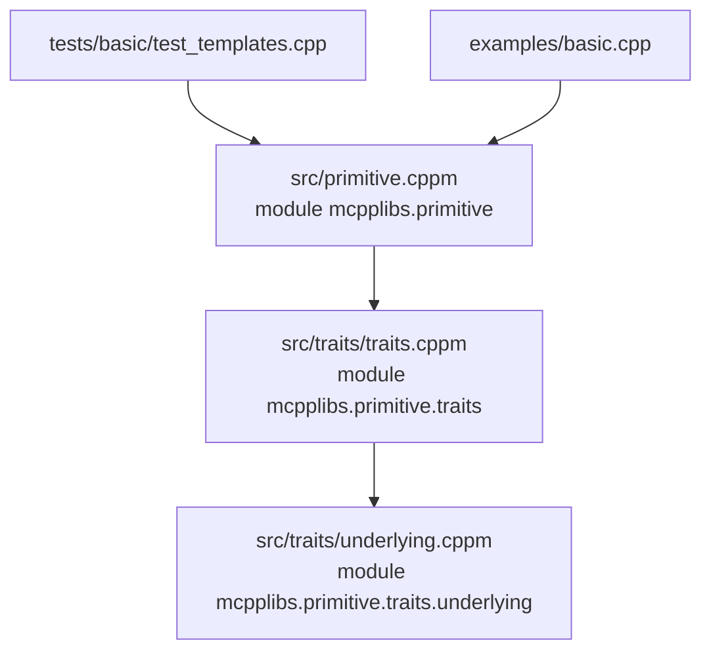

# 架构文档

> mcpplibs/primitives 当前架构与实现约定

## 概述

`mcpplibs/primitives` 是一个 C++23 Modules 优先的底层强类型原语库，当前阶段聚焦 traits 与 underlying 类型系统基础设施。

当前主目标：

- 提供统一的底层类型分类概念（`std_bool/std_char/std_integer/std_floating/std_underlying_type`）
- 提供可扩展的 `underlying::traits<T>` 机制，支持用户注册自定义 underlying
- 通过 `underlying_type` 建立稳定的公共准入概念

## 当前目录结构（核心）

```
primitives/
├── src/
│   ├── primitive.cppm
│   ├── primitives.cpp
│   └── traits/
│       ├── traits.cppm
│       └── underlying.cppm
├── tests/
│   └── basic/
│       └── test_templates.cpp
├── examples/
│   └── basic.cpp
└── .agents/docs/
    ├── RFC.md
    └── architecture.md
```

## 模块架构



### 聚合关系

- `mcpplibs.primitive` 再导出 `mcpplibs.primitive.traits`
- `mcpplibs.primitive.traits` 再导出 `mcpplibs.primitive.traits.underlying`

## 命名空间与 API 边界

### 公共 API（导出，稳定承诺）

- `mcpplibs::primitive::std_bool`
- `mcpplibs::primitive::std_char`
- `mcpplibs::primitive::std_integer`
- `mcpplibs::primitive::std_floating`
- `mcpplibs::primitive::std_underlying_type`
- `mcpplibs::primitive::underlying::category`
- `mcpplibs::primitive::underlying::traits<T>`
- `mcpplibs::primitive::underlying_type`

### 内部实现（不导出，不承诺稳定）

- `mcpplibs::primitive::underlying::details::*`

### 约定

- `details` 只用于拼装和校验公共概念，不作为上层依赖目标。
- 测试优先验证公共契约（如 `underlying_type`），避免绑定内部中间概念。
- 新增中间校验逻辑优先放入 `details`，仅在需要长期承诺时再提升为公共 API。

## underlying traits 设计

### 默认行为

- `underlying::traits<T>` 主模板默认 `enabled = false`
- 对满足 `std_underlying_type` 的标准类型提供默认特化：
  - `value_type = remove_cv_t<T>`
  - `rep_type = value_type`
  - `kind` 自动映射到 `category`
  - `to_rep/from_rep/is_valid_rep` 提供恒等默认实现

### 准入检查（由 `underlying_type` 统一约束）

`underlying_type` 由内部 `details` 组合校验：

- traits 是否启用
- 是否存在 `rep_type`
- `rep_type` 是否属于 `std_underlying_type`
- `kind` 与 `rep_type` 类别是否一致
- `to_rep/from_rep/is_valid_rep` 接口是否完整

## 构建系统现状

### CMake（主验证路径）

- 项目名：`mcpplibs-primitives`
- 最低 CMake 版本：`3.31`
- C++ 标准：`23`
- GNU 下启用：`-fmodules-ts`
- 模块文件通过 `src/*.cppm` 自动收集

推荐命令：

```bash
cmake -S . -B build -G Ninja
cmake --build build
ctest --test-dir build
```

### xmake

当前 xmake 目标命名已与 primitives 体系对齐：

- 库目标：`mcpplibs-primitives`
- 测试目标：`primitives_test`
- 示例 `basic` 依赖：`mcpplibs-primitives`

## 测试策略

当前 `tests/basic/test_templates.cpp` 覆盖以下关键路径：

- 标准类型分类概念判定
- 自定义类型 traits 注册后可通过 `underlying_type`
- 未注册类型不能通过 `underlying_type`
- 非法 `rep_type` 或 `kind` 不一致时，`underlying_type` 失败

## 后续演进建议

1. 增加四个派生概念：`boolean_underlying_type`、`char_underlying_type`、`integer_underlying_type`、`floating_underlying_type`
2. 开始引入四类策略标签（value/type/error/concurrency）
3. 实现无运算的 primitive 包装壳（只存值与策略标签）
4. 将 xmake target 命名从 `templates` 统一迁移到 `primitives`

## 策略（Policy）模块

项目中新增了 `mcpplibs::primitive::policy` 模块，用来表达运行时/编译期的策略标签。核心要点：

- `policy::category`：一个枚举，用以表示四类策略：`value`、`type`、`error`、`concurrency`。
- 每个 policy 类型匹配一个 `policy::traits<P>` 特化，`traits` 提供 `enabled` 和 `kind`（category）。
- 提供了 `policy::policy_type<P>` 概念用于识别有效的 policy 类型。
- `policy::default_policies` 提供库的默认策略集合（`value`, `type`, `error`, `concurrency`）。

示例用法见 [examples/basic.cpp](examples/basic.cpp#L1)（演示如何查询默认策略与内建策略的类别）。

## Primitive 类模板 设计（草案）

目标：提供零开销、策略化的 `primitive<T, Policies...>` 类模板，作为后续实现 `Integer/ Floating/ Boolean/ Char` 等包装器的基础。

设计要点：

- 定位：实现放置在 `src/primitive.cppm` 的分区或 `src/primitives/primitive.cppm`（按模块组织），导出至 `mcpplibs.primitive`。
- 存储：`primitive<T, Policies...>` 应仅持有 `T`（或 `value_type`）的值，不含运行时策略开销；策略仅作为类型标签存在。
- 策略传播：添加 `traits/primitive_traits.cppm`，提供 `primitive_traits<Primitive>`，包含：
  - `using value_type` — 底层类型
  - `using policies = std::tuple<...>` — 策略标签元组
  - `using default_policies = policy::default_policies`
  - 编译期谓词 `has_policy_category<Primitive, policy::category::value>` 等，便于操作 trait 的约束和重载。
- 可扩展性：`primitive` 的操作（例如算术、比较）将通过独立的 operation traits 和 concepts 实现，使用 `primitive_traits` 中的 policy 信息进行选择。

示例 API 草案：

```cpp
template<typename T, typename...Policies>
struct primitive {
  using value_type = T;
  using policies = std::tuple<Policies...>;
  constexpr explicit primitive(T v) noexcept : value(v) {}
  T value;
};

template<typename P> struct primitive_traits; // 特化以导出信息
```

下一步：我将实现 `primitive` 模板与 `primitive_traits`，并添加单元测试与示例。

## 参考

- RFC: `RFC.md`
- mcpp-style-ref: `../skills/mcpp-style-ref/SKILL.md`
