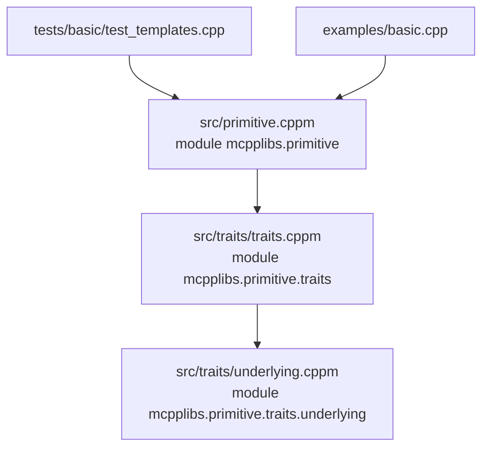

# 架构文档

> mcpplibs/primitives 当前架构与实现约定

## 概述

`mcpplibs/primitives` 是一个 C++23 Modules 优先的底层强类型原语库，当前阶段聚焦 traits 与 underlying 类型系统基础设施。

当前主目标：

- 提供统一的底层类型分类概念（`std_bool/std_char/std_integer/std_floating/std_underlying_type`）
- 提供可扩展的 `underlying::traits<T>` 机制，支持用户注册自定义 underlying
- 通过 `underlying_type` 建立稳定的公共准入概念

## 当前目录结构（核心）

```
primitives/
├── src/
│   ├── primitive.cppm
│   ├── primitives.cpp
│   └── traits/
│       ├── traits.cppm
│       └── underlying.cppm
├── tests/
│   └── basic/
│       └── test_templates.cpp
├── examples/
│   └── basic.cpp
└── .agents/docs/
    ├── RFC.md
    └── architecture.md
```

## 模块架构



### 聚合关系

- `mcpplibs.primitive` 再导出 `mcpplibs.primitive.traits`
- `mcpplibs.primitive.traits` 再导出 `mcpplibs.primitive.traits.underlying`

## 命名空间与 API 边界

### 公共 API（导出，稳定承诺）

- `mcpplibs::primitive::std_bool`
- `mcpplibs::primitive::std_char`
- `mcpplibs::primitive::std_integer`
- `mcpplibs::primitive::std_floating`
- `mcpplibs::primitive::std_underlying_type`
- `mcpplibs::primitive::underlying::category`
- `mcpplibs::primitive::underlying::traits<T>`
- `mcpplibs::primitive::underlying_type`

### 内部实现（不导出，不承诺稳定）

- `mcpplibs::primitive::underlying::details::*`

### 约定

- `details` 只用于拼装和校验公共概念，不作为上层依赖目标。
- 测试优先验证公共契约（如 `underlying_type`），避免绑定内部中间概念。
- 新增中间校验逻辑优先放入 `details`，仅在需要长期承诺时再提升为公共 API。

## underlying traits 设计

### 默认行为

- `underlying::traits<T>` 主模板默认 `enabled = false`
- 对满足 `std_underlying_type` 的标准类型提供默认特化：
  - `value_type = remove_cv_t<T>`
  - `rep_type = value_type`
  - `kind` 自动映射到 `category`
  - `to_rep/from_rep/is_valid_rep` 提供恒等默认实现

### 准入检查（由 `underlying_type` 统一约束）

`underlying_type` 由内部 `details` 组合校验：

- traits 是否启用
- 是否存在 `rep_type`
- `rep_type` 是否属于 `std_underlying_type`
- `kind` 与 `rep_type` 类别是否一致
- `to_rep/from_rep/is_valid_rep` 接口是否完整

## 构建系统现状

### CMake（主验证路径）

- 项目名：`mcpplibs-primitives`
- 最低 CMake 版本：`3.31`
- C++ 标准：`23`
- GNU 下启用：`-fmodules-ts`
- 模块文件通过 `src/*.cppm` 自动收集

推荐命令：

```bash
cmake -S . -B build -G Ninja
cmake --build build
ctest --test-dir build
```

### xmake（待命名同步）

当前 `xmake.lua` 与子目录配置仍保留部分 `templates` 历史 target 名称（例如 `mcpplibs-templates`、`templates_test`），后续建议统一为 `primitives` 命名体系。

## 测试策略

当前 `tests/basic/test_templates.cpp` 覆盖以下关键路径：

- 标准类型分类概念判定
- 自定义类型 traits 注册后可通过 `underlying_type`
- 未注册类型不能通过 `underlying_type`
- 非法 `rep_type` 或 `kind` 不一致时，`underlying_type` 失败

## 后续演进建议

1. 增加四个派生概念：`boolean_underlying_type`、`char_underlying_type`、`integer_underlying_type`、`floating_underlying_type`
2. 开始引入四类策略标签（value/type/error/concurrency）
3. 实现无运算的 primitive 包装壳（只存值与策略标签）
4. 将 xmake target 命名从 `templates` 统一迁移到 `primitives`

## 参考

- RFC: `RFC.md`
- mcpp-style-ref: `../skills/mcpp-style-ref/SKILL.md`
